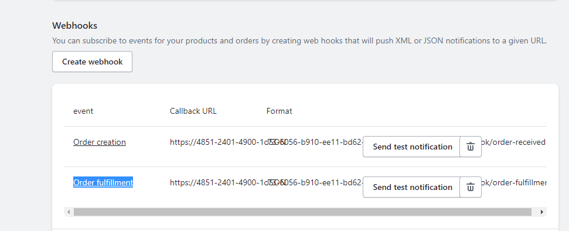

## Installation

1. Specify Database connection
```bash
PORT=8080
#DATABASE
DB_HOST=localhost
DB_USER=postgres
DB_PASSWORD=
DB_NAME=
DB_PORT=5432
EMAIL_NOTIFICATION=example@gmail.com
```

2. To Auto generate Tables
```bash
  npm run create-tables
```

3. Install Npm packages

```bash
  npm run install
```
4. start Node App

```bash
  npm run start
```

## Create Webhooks 

From your Shopify admin, go to Settings > Notifications. 

Create Webhook
1.) Order creation for Api endpoint (BASE_URL//api/webhook/order-fulfillment)
2.) Order fulfillment for Api endpoint (BASE_URL//api/webhook/order-fulfillment)


